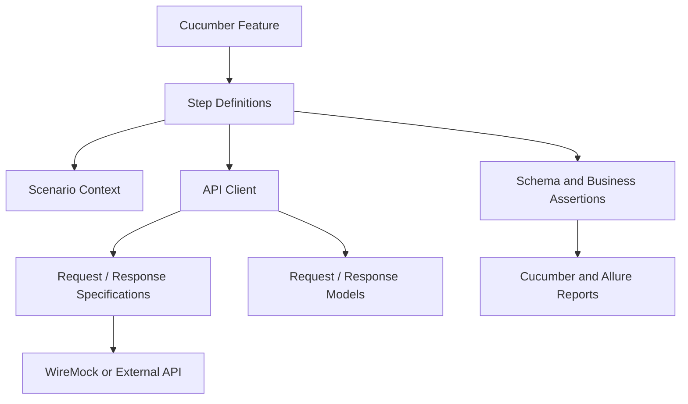

# REST Assured Java BDD API Test Automation Framework

[](https://github.com/venkatr184/rest-assured-bdd-api-automation-framework/actions/workflows/api-tests.yml)

A production-style **REST Assured Java API test automation framework** built with **Cucumber BDD, JUnit 5, Maven, WireMock, JSON Schema validation, Allure reporting, and GitHub Actions CI/CD**.

This independently developed portfolio project demonstrates scalable API test-automation architecture using reusable API clients, request/response specifications, typed models, business-readable Gherkin scenarios, dependency injection, service virtualization, parallel execution, resilience testing, secure configuration, correlation IDs, automated reporting, and CI quality gates.

## What This Project Demonstrates

- Designing a maintainable Java REST API automation framework
- Applying Cucumber BDD to business-readable API scenarios
- Separating Gherkin scenarios, step definitions, API clients, specifications, models, configuration, and assertions
- Centralizing reusable REST Assured request and response specifications
- Using typed Java request and response models
- Managing scenario state through context objects and dependency injection
- Validating HTTP contracts with JSON Schema and business assertions
- Using WireMock for deterministic service virtualization and resilience testing
- Supporting positive, negative, authenticated, unauthorized, and data-driven scenarios
- Executing scenarios in parallel with scenario-safe state management
- Applying controlled retries only to approved transient failures and idempotent operations
- Propagating correlation IDs for request traceability
- Enforcing formatting and coding standards through automated quality gates
- Generating Cucumber and Allure reports with execution metadata
- Running API automation continuously through GitHub Actions

## Technology Stack

| Area | Technology / Approach |
| --- | --- |
| Programming language | Java 17 |
| Build and dependency management | Maven / Maven Wrapper |
| API automation | REST Assured |
| BDD | Cucumber |
| Test platform | JUnit 5 Platform |
| Serialization | Jackson |
| Contract validation | JSON Schema Validator |
| Dependency injection | PicoContainer |
| Service virtualization | WireMock |
| Reporting | Cucumber HTML/JSON and Allure |
| Code formatting | Spotless / Google Java Format |
| Static standards | Checkstyle |
| CI/CD | GitHub Actions |
| Dependency maintenance | Dependabot |

## Key Features

### Framework Architecture
- API client abstraction
- Reusable request and response specifications
- Typed request and response models
- Cucumber scenario context
- Constructor-based dependency injection
- Environment-based configuration
- System-property and environment-variable overrides
- Typed JSON test-data loading
- Reusable classpath-based payload files

### Test Coverage and Validation
- Positive and negative API scenarios
- Data-driven Cucumber Scenario Outlines
- HTTP status validation
- JSON Schema validation
- Business-rule validation
- Request method, endpoint, header, and body verification
- Response-time assertions
- Authorized and unauthorized API scenarios

### Reliability and Observability
- Controlled retry strategy for transient HTTP failures
- Configurable retry attempts and backoff delay
- Configurable connection, socket, and connection-manager timeouts
- Scenario-scoped correlation IDs
- Correlation preservation across retries
- Failure-only request and response logging
- Automatic failure-response attachment
- Sensitive-header masking

### Service Virtualization and Execution
- Embedded WireMock service virtualization
- Dynamic WireMock port allocation
- Stateful WireMock resilience testing
- WireMock request-header verification
- Parallel Cucumber scenario execution
- Thread-local cleanup for parallel safety
- Tag-based execution

### Quality and CI/CD
- Google Java Format enforcement with Spotless
- Static coding-standard validation with Checkstyle
- Maven `verify` quality gate
- Reproducible builds through Maven Wrapper
- Cucumber HTML and JSON reports
- Interactive Allure reports
- Automatic Allure environment metadata
- GitHub Actions CI
- Automated Maven and GitHub Actions dependency updates

## Architecture

The framework uses a layered design to keep business scenarios readable while isolating HTTP implementation, configuration, test state, models, service virtualization, and validation concerns.



### Architectural Responsibilities

| Layer | Responsibility |
| --- | --- |
| Feature files | Business-readable API scenarios and examples |
| Step definitions | Translate Gherkin intent into automation actions and assertions |
| Scenario context | Maintain scenario-scoped state safely |
| API clients | Encapsulate endpoint operations and HTTP behavior |
| Request/response specifications | Centralize common REST Assured configuration, headers, authentication, and logging |
| Request/response models | Provide typed Java payload representations |
| Configuration | Resolve environment, system-property, and environment-variable settings |
| WireMock | Provide deterministic service virtualization and controlled failure behavior |
| Schemas/assertions | Validate API contracts and business behavior |
| Reporting | Publish execution results, metadata, and failure evidence |
| CI/CD | Execute quality gates and automated test suites |

### Request Execution Flow

```text
Cucumber Feature
      |
      v
Step Definition
      |
      +----> Scenario Context
      |
      v
API Client
      |
      +----> Request Model / Test Data
      |
      v
REST Assured Request Specification
      |
      +----> Authentication
      +----> Correlation ID
      +----> Timeout Configuration
      +----> Failure Logging
      |
      v
WireMock or External REST API
      |
      v
Response
      |
      +----> Status / Business Assertions
      +----> JSON Schema Validation
      +----> Response-Time Assertion
      |
      v
Cucumber / Allure Reporting
```

## Project Structure

```text
src
├── main
│   └── java/com/automation/api
│       ├── auth
│       ├── client
│       ├── config
│       ├── constants
│       ├── exception
│       ├── model
│       │   ├── request
│       │   └── response
│       ├── specification
│       └── utility
└── test
    ├── java/com/automation/api
    │   ├── context
    │   ├── hooks
    │   ├── mock
    │   ├── runner
    │   └── steps
    └── resources
        ├── config
        ├── features
        ├── schemas
        ├── testdata
        ├── allure.properties
        └── junit-platform.properties
```

## Test Automation Strategy

The framework supports multiple API-testing concerns without mixing infrastructure details into business-readable scenarios:

- **Smoke testing** for fast validation of critical API behavior
- **Regression testing** for broader API coverage
- **Negative testing** for invalid requests and error behavior
- **Contract testing** through JSON Schema validation
- **Business-rule validation** beyond transport-level status checks
- **Authentication testing** for authorized and unauthorized requests
- **Data-driven testing** using Scenario Outlines, Gherkin tables, and external JSON data
- **Resilience testing** using controlled transient failures through WireMock
- **Performance checks** using independent response-time assertions
- **Parallel execution** for faster scenario processing

## Current Test Coverage

The repository currently demonstrates:

- Retrieve existing posts using data-driven scenarios
- Create a post using a serialized Java request model
- Validate HTTP status codes
- Validate success-response schemas
- Validate response business values
- Validate request method, endpoint, headers, and body
- Validate resource-not-found responses
- Validate internal-server-error responses
- Validate authenticated API requests
- Validate unauthorized responses when credentials are missing
- Validate recovery from a transient `503` response
- Validate controlled retry of an idempotent GET operation
- Create request payloads from external JSON test data
- Verify correlation IDs are sent with every API request
- Verify retry attempts preserve the same correlation ID

## Prerequisites

- Java 17 or later
- Git
- Allure CLI (optional, for viewing Allure reports)

A separate Maven installation is optional because the repository includes Maven Wrapper.

Verify the local tools:

```bash
java -version
git --version
```

If Maven is installed globally, you can also verify it with:

```bash
mvn -version
```

## Getting Started

### 1. Clone the repository

```bash
git clone https://github.com/venkatr184/rest-assured-bdd-api-automation-framework.git
cd rest-assured-bdd-api-automation-framework
```

### 2. Run the complete quality gate and test suite

```bash
./mvnw clean verify
```

By default, the suite starts an embedded WireMock server and executes against deterministic mock responses.

> On Windows Command Prompt, use `mvnw.cmd` instead of `./mvnw`.

## Tag-Based Execution

Run smoke tests:

```bash
./mvnw clean test -Dcucumber.filter.tags="@smoke"
```

Run regression tests:

```bash
./mvnw clean test -Dcucumber.filter.tags="@regression"
```

Run negative tests:

```bash
./mvnw clean test -Dcucumber.filter.tags="@negative"
```

Run API tests except negative scenarios:

```bash
./mvnw clean test -Dcucumber.filter.tags="@api and not @negative"
```

## Configuration Management

Configuration values are resolved in the following precedence:

1. Java system properties
2. Operating-system environment variables
3. Environment properties file

Example system-property override:

```bash
./mvnw test \
  -Dwiremock.enabled=false \
  -Dbase.url=https://jsonplaceholder.typicode.com
```

Equivalent environment-variable override:

```bash
export BASE_URL=https://jsonplaceholder.typicode.com
./mvnw test -Dwiremock.enabled=false
```

### Run Against the External Demonstration API

WireMock is enabled by default. To use the URL configured in `dev.properties`:

```bash
./mvnw clean test -Dwiremock.enabled=false
```

> Some WireMock-specific scenarios may not behave identically against an external API because they intentionally depend on controlled mock behavior.

## Authentication and Secret Management

API-key authentication is applied centrally by the request-specification layer.

Configure it using an environment variable:

```bash
export API_KEY=your-secure-api-key
./mvnw test -Dwiremock.enabled=false
```

Or provide it as a system property:

```bash
./mvnw test -Dwiremock.enabled=false -Dapi.key=your-secure-api-key
```

Security controls include:

- No credentials or tokens committed to source control
- Sensitive authentication headers masked from REST Assured logs
- Environment-based secret injection
- Generated reports and environment files ignored
- Synthetic test data only
- No proprietary source code or internal company information

## Test-Data Management

Small business-readable inputs may be represented directly in Gherkin tables. Larger or reusable request payloads are stored under:

```text
src/test/resources/testdata
```

The data flow is:

```text
JSON Test Data
      |
      v
JsonDataLoader
      |
      v
Typed Request Model
      |
      v
API Client
```

This keeps reusable payload data separate from Gherkin implementation and Java test logic.

## Request Correlation and Traceability

Every scenario receives a unique `X-Correlation-ID` header.

```text
Cucumber Scenario
      |
      v
CorrelationIdContext
      |
      v
REST Assured Request Specification
      |
      v
API Request
      |
      v
WireMock Verification
```

The same correlation ID is preserved across retry attempts, supporting request traceability and deterministic verification.

## Timeout and Performance Strategy

The framework distinguishes transport-level timeouts from test-level performance assertions.

| Configuration | Purpose |
| --- | --- |
| `http.connection.timeout.ms` | Maximum time allowed to establish an HTTP connection |
| `http.socket.timeout.ms` | Maximum time allowed while waiting for response data |
| `http.connection.manager.timeout.ms` | Maximum wait for an available pooled connection |
| `response.time.limit.ms` | Maximum acceptable response time validated after a response arrives |

Transport timeouts stop stalled requests. The response-time limit is an independent test assertion and does not replace network timeout configuration.

Values can be overridden using environment variables:

```bash
export HTTP_CONNECTION_TIMEOUT_MS=3000
export HTTP_SOCKET_TIMEOUT_MS=5000
export HTTP_CONNECTION_MANAGER_TIMEOUT_MS=3000
export RESPONSE_TIME_LIMIT_MS=10000
```

## Retry and Resilience Strategy

Retries are applied only to explicitly retryable, idempotent operations.

Retryable status codes:

- `429 Too Many Requests`
- `502 Bad Gateway`
- `503 Service Unavailable`
- `504 Gateway Timeout`

The framework does **not** automatically retry:

- Client errors such as `400`, `401`, `403`, and `404`
- Business assertion failures
- Non-idempotent POST requests
- Every `500` response without an approved service-specific rule

Retry settings:

```properties
retry.max.attempts=3
retry.delay.ms=200
```

WireMock provides deterministic stateful scenarios for validating transient failures and recovery behavior.

## Parallel Execution

Cucumber scenarios execute in parallel using:

```text
src/test/resources/junit-platform.properties
```

The default parallelism is three worker threads.

Scenario-scoped state, correlation handling, and thread-local cleanup are designed to keep parallel scenarios isolated.

## Code Quality

The repository uses automated formatting and static validation as part of the Maven quality gate.

Run formatting when required:

```bash
./mvnw spotless:apply
```

Run the complete quality gate:

```bash
./mvnw clean verify
```

Additional validation before committing:

```bash
./mvnw checkstyle:check
git diff --check
git status --short
```

The `verify` lifecycle is intended to provide the primary repeatable build and test validation before changes are pushed.

## Reports and Failure Diagnostics

### Cucumber Reports

After execution:

```text
target/cucumber-report/cucumber.html
target/cucumber-report/cucumber.json
```

### Allure Report

Generate an Allure report:

```bash
allure generate target/allure-results \
  --clean \
  --output target/allure-report
```

Open it:

```bash
allure open target/allure-report
```

For temporary local viewing:

```bash
allure serve target/allure-results
```

### Allure Environment Information

Each Allure execution records:

- Selected test environment
- WireMock or external API execution mode
- Java version
- Operating system
- Processor architecture
- Parallel-execution status
- Configured parallelism

The metadata is generated at:

```text
target/allure-results/environment.properties
```

The framework also supports failure-only request/response logging and automatic failure-response attachment while masking sensitive authentication headers.

## Execution Evidence

### Allure Test Report

The Allure report provides scenario results, execution timelines, environment metadata, and failure evidence.


### GitHub Actions

Push and pull-request execution runs the Maven quality gate and preserves Cucumber, Allure, and Surefire reports.


## Continuous Integration and CI/CD

GitHub Actions executes the Maven quality gate so formatting, coding standards, build validation, and automated API tests can be evaluated consistently in CI.

The CI workflow preserves test evidence including:

- Cucumber reports
- Allure results
- Surefire reports

A failed quality gate or automated test produces a non-successful build result, allowing CI status to be used as a repository quality signal.

## Dependency Maintenance

Dependabot checks Maven dependencies and GitHub Actions every Sunday.

- Minor and patch updates are grouped
- Major upgrades are raised separately for controlled review
- Dependency changes must pass the Maven quality gate before merging

This keeps dependency maintenance automated while retaining validation before integration.

## Framework Design Principles

- Keep Gherkin scenarios business-readable and implementation-independent.
- Keep endpoint interaction logic inside reusable API clients.
- Centralize common REST Assured configuration in specifications.
- Use typed models instead of scattering raw payload construction through step definitions.
- Separate reusable test data from scenario implementation.
- Keep scenario state isolated for safe parallel execution.
- Retry only explicitly approved transient failures on safe operations.
- Treat transport timeouts and performance assertions as separate concerns.
- Propagate correlation IDs to improve request traceability.
- Mask sensitive authentication information from logs and reports.
- Use deterministic service virtualization for failure and resilience scenarios.
- Make local and CI execution reproducible through Maven Wrapper and automated quality gates.

## Portfolio and Engineering Value

This project demonstrates capabilities relevant to **API Automation Engineer, SDET, QA Automation Architect, Test Automation Architect, and Quality Engineering** roles, including:

- REST Assured framework architecture
- Java API test automation
- Cucumber BDD and Gherkin
- API client and specification design
- Request/response modeling
- JSON Schema contract validation
- Service virtualization with WireMock
- API authentication and secure configuration
- Data-driven API testing
- Parallel execution
- Retry and resilience testing
- Correlation and traceability
- Failure diagnostics and Allure reporting
- Maven quality gates
- GitHub Actions CI/CD
- Dependency maintenance

## Future Enhancements

Potential extensions for the framework include:

- Additional API contract-testing scenarios
- Expanded reusable assertion utilities
- Additional authentication patterns
- Broader service-virtualization scenarios
- Containerized execution
- Test-result trend reporting
- Additional API performance and observability examples

## Author

**Venkata Reddy K**  
QA Automation Architect | Java | REST Assured | Cucumber BDD | API Automation | CI/CD

- GitHub: [venkatr184](https://github.com/venkatr184)

## Project Purpose

This repository is an independently developed educational and professional portfolio project demonstrating scalable **Java REST Assured API automation**, **Cucumber BDD**, service virtualization, resilience testing, reporting, and CI/CD practices.

It uses a fictional API-testing context and publicly available demonstration concepts. It is not associated with any employer, client, or production system.
