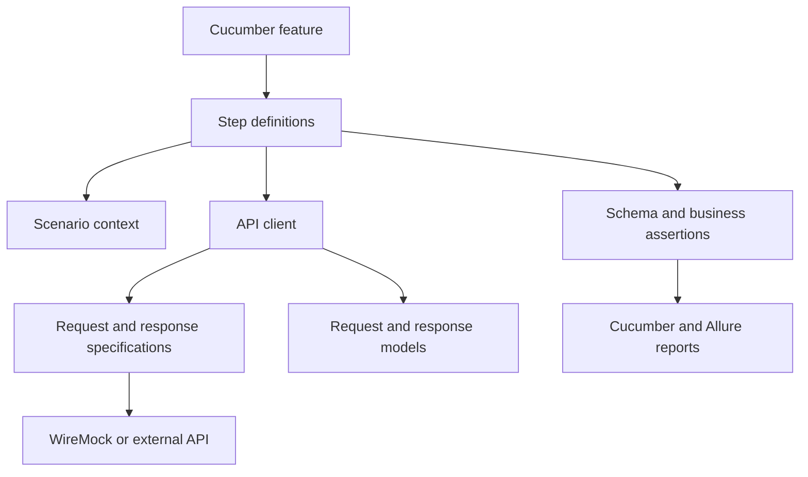
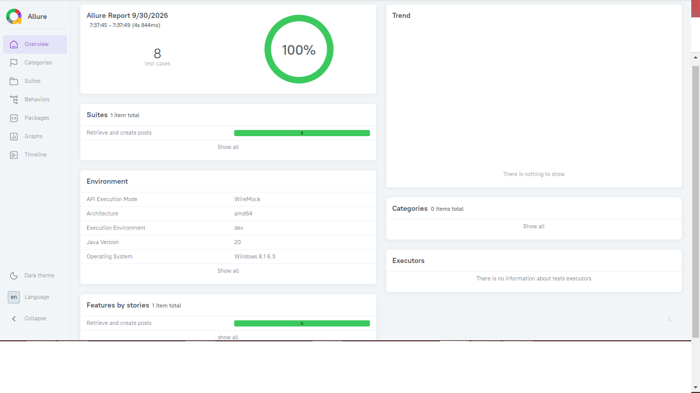
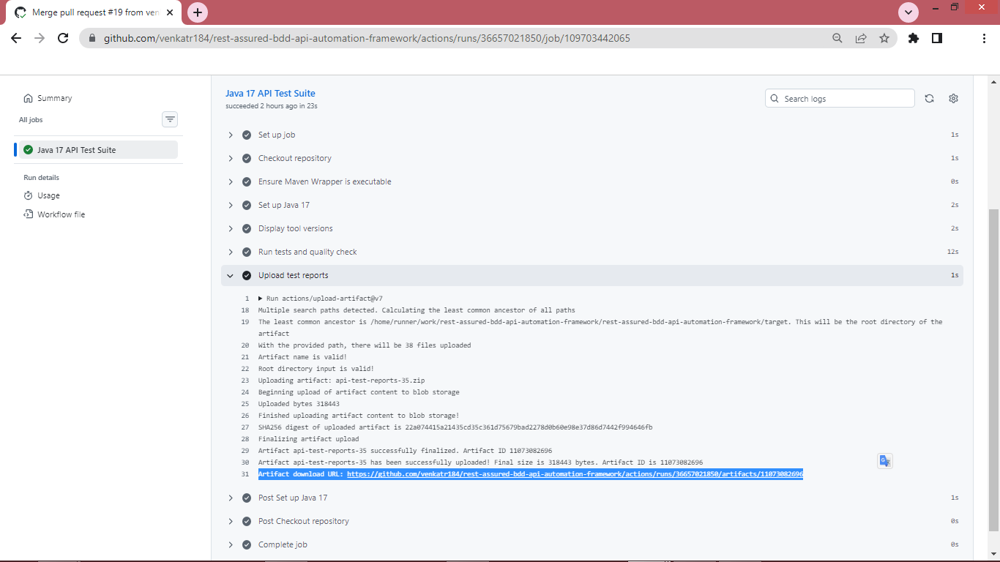

# REST Assured BDD API Automation Framework

[](https://github.com/venkatr184/rest-assured-bdd-api-automation-framework/actions/workflows/api-tests.yml)

A production-style API automation framework built with Java, REST Assured, Cucumber BDD, JUnit 5, Maven and WireMock.

This independently developed portfolio project demonstrates reusable API-client design, business-readable BDD scenarios, schema validation, service virtualization, parallel execution and automated reporting.

## Technology Stack

- Java 17
- Maven
- REST Assured
- Cucumber BDD
- JUnit 5 Platform
- Jackson
- JSON Schema Validator
- PicoContainer
- WireMock
- Allure Report
- GitHub Actions

## Key Features

- Google Java Format enforcement with Spotless
- Static coding-standard validation with Checkstyle
- Maven `verify` quality gate
- Reusable request and response specifications
- Environment-based configuration
- System-property and environment-variable overrides
- API client abstraction
- Request and response models
- Cucumber scenario context
- Constructor-based dependency injection
- Positive and negative API scenarios
- Data-driven Scenario Outlines
- JSON Schema validation
- Business-rule validation
- Embedded WireMock service virtualization
- Dynamic WireMock port allocation
- Parallel scenario execution
- Tag-based execution
- Sensitive-header masking
- Failure-only request and response logging
- Automatic failure-response attachment
- Cucumber HTML and JSON reports
- Interactive Allure reports
- Centralized optional API-key authentication
- Environment-based secret injection
- Authentication-header masking
- Authorized and unauthorized API scenarios
- Automated Maven and GitHub Actions dependency updates
- Reproducible Maven builds through Maven Wrapper
- Controlled retry strategy for transient HTTP failures
- Configurable retry attempts and backoff delay
- Stateful WireMock resilience testing
- Configurable connection, socket and connection-manager timeouts
- Independent response-time performance assertions
- Typed JSON test-data loading
- Reusable classpath-based payload files
- Separation of test data from Gherkin implementation
- Scenario-scoped correlation IDs
- Correlation preservation across retries
- WireMock request-header verification
- Thread-local cleanup for parallel safety
- Automatic Allure environment metadata
- Execution-mode and parallelism reporting

## Request Correlation

Every scenario receives a unique `X-Correlation-ID` header.

```text
Cucumber scenario
    → CorrelationIdContext
    → REST Assured request specification
    → API request
    → WireMock verification
```

## Test-Data Management

Small business-readable inputs may be represented directly in Gherkin tables. Larger or reusable request payloads are stored under:

```text
src/test/resources/testdata
JSON test data → JsonDataLoader → Request model → API client
```

## Timeout Strategy

The framework distinguishes transport timeouts from performance assertions.

| Configuration | Purpose |
|---|---|
| `http.connection.timeout.ms` | Maximum time allowed to establish an HTTP connection |
| `http.socket.timeout.ms` | Maximum time allowed while waiting for response data |
| `http.connection.manager.timeout.ms` | Maximum wait for an available pooled connection |
| `response.time.limit.ms` | Maximum acceptable response time validated after a response arrives |

Transport timeouts stop stalled requests. The response-time limit is a test assertion and does not replace network timeout configuration.

Values can be overridden using environment variables:

```bash
export HTTP_CONNECTION_TIMEOUT_MS=3000
export HTTP_SOCKET_TIMEOUT_MS=5000
export HTTP_CONNECTION_MANAGER_TIMEOUT_MS=3000
export RESPONSE_TIME_LIMIT_MS=10000
```

### Validate

```bash
./mvnw spotless:apply
./mvnw clean verify
git diff --check
cat target/allure-results/environment.properties
git status --short
```

## Architecture



## Project Structure

```text
src
├── main
│   └── java/com/automation/api
│       ├── auth
│       ├── client
│       ├── config
│       ├── constants
│       ├── exception
│       ├── model
│       │   ├── request
│       │   └── response
│       ├── specification
│       └── utility
└── test
    ├── java/com/automation/api
    │   ├── context
    │   ├── hooks
    │   ├── mock
    │   ├── runner
    │   └── steps
    └── resources
        ├── config
        ├── features
        ├── schemas
        ├── testdata
        ├── allure.properties
        └── junit-platform.properties
```

## Execution Evidence

### Allure Test Report

The Allure report provides scenario results, execution timelines, environment metadata and failure evidence.



### GitHub Actions

Every push and pull request executes the Maven quality gate and preserves Cucumber, Allure and Surefire reports.




## Prerequisites

- Java 17 or later
- Git
- Allure CLI, optional for viewing Allure reports

Maven installation is optional because the repository includes Maven Wrapper.

Verify the installation:

```bash
java -version
mvn -version
git --version
```

## Run the Complete Suite

```bash
./mvnw clean verify
```

By default, the suite starts an embedded WireMock server and executes against deterministic mock responses.

## Tag-Based Execution

Run smoke tests:

```bash
mvn clean test -Dcucumber.filter.tags="@smoke"
```

Run regression tests:

```bash
mvn clean test -Dcucumber.filter.tags="@regression"
```

Run negative tests:

```bash
mvn clean test -Dcucumber.filter.tags="@negative"
```

Run all API tests except negative scenarios:

```bash
mvn clean test \
  -Dcucumber.filter.tags="@api and not @negative"
```

## Run Against the External Demonstration API

WireMock is enabled by default. To use the URL configured in `dev.properties`:

```bash
mvn clean test -Dwiremock.enabled=false
```

> Some WireMock-specific scenarios may not behave identically against an external API.

## Configuration Precedence

Configuration values are resolved in this order:

1. Java system properties
2. Operating-system environment variables
3. Environment properties file

Example system-property override:

```bash
mvn test \
  -Dwiremock.enabled=false \
  -Dbase.url=https://jsonplaceholder.typicode.com
```

Equivalent environment-variable override:

```bash
export BASE_URL=https://jsonplaceholder.typicode.com
mvn test -Dwiremock.enabled=false
```

## Parallel Execution

Cucumber scenarios execute in parallel using the configuration in:

```text
src/test/resources/junit-platform.properties
```

The default parallelism is three worker threads.

## Reports

After execution, the Cucumber reports are available at:

```text
target/cucumber-report/cucumber.html
target/cucumber-report/cucumber.json
```

Generate an Allure report:

```bash
allure generate target/allure-results \
  --clean \
  --output target/allure-report
```

Open the report:

```bash
allure open target/allure-report
```

For temporary local viewing:

```bash
allure serve target/allure-results
```

### Allure Environment Information

Each Allure execution records:

- Selected test environment
- WireMock or external API execution mode
- Java version
- Operating system
- Processor architecture
- Parallel-execution status
- Configured parallelism

The metadata is generated at:

```text
target/allure-results/environment.properties
```

## Current Test Coverage

- Retrieve existing posts using data-driven scenarios
- Create a post using a serialized Java request model
- Validate HTTP status codes
- Validate success-response schemas
- Validate response business values
- Validate request method, endpoint, headers and body
- Validate resource-not-found responses
- Validate internal-server-error responses
- Validate authenticated API requests
- Validate unauthorized responses when credentials are missing
- Validate recovery from a transient `503` response
- Validate controlled retry of an idempotent GET operation
- Create request payloads from external JSON test data
- Verify correlation IDs are sent with every API request
- Verify retry attempts preserve the same correlation ID

## Retry Strategy

Retries are applied only to explicitly retryable, idempotent operations.

Retryable status codes:

- `429 Too Many Requests`
- `502 Bad Gateway`
- `503 Service Unavailable`
- `504 Gateway Timeout`

The framework does not automatically retry:

- Client errors such as `400`, `401`, `403` and `404`
- Business assertion failures
- Non-idempotent POST requests
- Every `500` response without an approved service-specific rule

Retry settings are configured through:

```properties
retry.max.attempts=3
retry.delay.ms=200
```

## Security

- No credentials or tokens are committed.
- Sensitive authentication headers are masked from REST Assured logs.
- Generated reports and environment files are ignored.
- Only synthetic test data is used.
- The project contains no proprietary source code or internal company information.

## Authentication

API-key authentication is applied centrally by the request-specification layer.

Configure it using an environment variable:

```bash
export API_KEY=your-secure-api-key
mvn test -Dwiremock.enabled=false
(OR)
mvn test -Dwiremock.enabled=false -Dapi.key=your-secure-api-key
```


### Validate before committing

```bash
mvn checkstyle:check
mvn spotless:apply
mvn clean verify
git status --short
git diff --stat
```

## Dependency Maintenance

Dependabot checks Maven dependencies and GitHub Actions every Sunday. Minor and patch updates are grouped, while major upgrades are raised separately for controlled review.

Every dependency update must pass the Maven quality gate before merging.

## Disclaimer

This repository is an independently developed portfolio project. It uses a fictional API-testing context and publicly available demonstration concepts. It is not associated with any employer, client or production system.