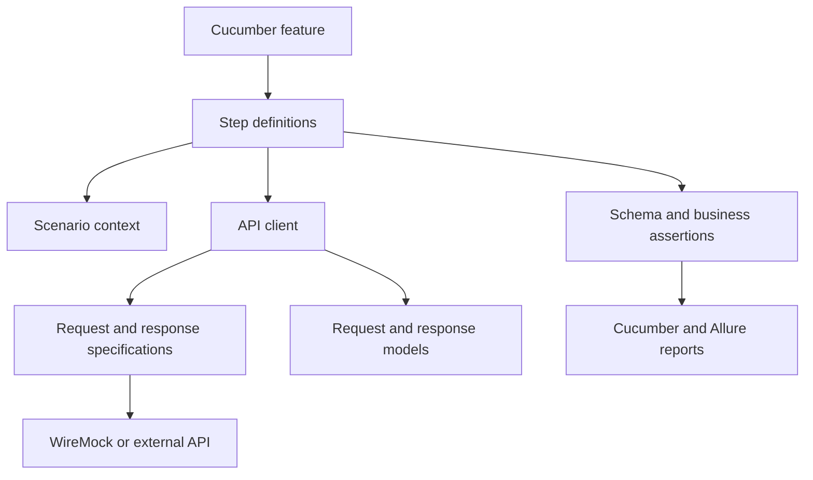

# REST Assured BDD API Automation Framework

[](https://github.com/venkatr184/rest-assured-bdd-api-automation-framework/actions/workflows/api-tests.yml)

A production-style API automation framework built with Java, REST Assured, Cucumber BDD, JUnit 5, Maven and WireMock.

This independently developed portfolio project demonstrates reusable API-client design, business-readable BDD scenarios, schema validation, service virtualization, parallel execution and automated reporting.

## Technology Stack

- Java 17
- Maven
- REST Assured
- Cucumber BDD
- JUnit 5 Platform
- Jackson
- JSON Schema Validator
- PicoContainer
- WireMock
- Allure Report
- GitHub Actions

## Key Features

- Google Java Format enforcement with Spotless
- Static coding-standard validation with Checkstyle
- Maven `verify` quality gate
- Reusable request and response specifications
- Environment-based configuration
- System-property and environment-variable overrides
- API client abstraction
- Request and response models
- Cucumber scenario context
- Constructor-based dependency injection
- Positive and negative API scenarios
- Data-driven Scenario Outlines
- JSON Schema validation
- Business-rule validation
- Embedded WireMock service virtualization
- Dynamic WireMock port allocation
- Parallel scenario execution
- Tag-based execution
- Sensitive-header masking
- Failure-only request and response logging
- Automatic failure-response attachment
- Cucumber HTML and JSON reports
- Interactive Allure reports

## Architecture



## Project Structure

```text
src
├── main
│   └── java/com/automation/api
│       ├── auth
│       ├── client
│       ├── config
│       ├── constants
│       ├── exception
│       ├── model
│       │   ├── request
│       │   └── response
│       ├── specification
│       └── utility
└── test
    ├── java/com/automation/api
    │   ├── context
    │   ├── hooks
    │   ├── mock
    │   ├── runner
    │   └── steps
    └── resources
        ├── config
        ├── features
        ├── schemas
        ├── testdata
        ├── allure.properties
        └── junit-platform.properties
```

## Prerequisites

- Java 17 or later
- Maven 3.9 or later
- Git
- Allure CLI, optional for viewing Allure reports

Verify the installation:

```bash
java -version
mvn -version
git --version
```

## Run the Complete Suite

```bash
mvn clean test
```

By default, the suite starts an embedded WireMock server and executes against deterministic mock responses.

## Tag-Based Execution

Run smoke tests:

```bash
mvn clean test -Dcucumber.filter.tags="@smoke"
```

Run regression tests:

```bash
mvn clean test -Dcucumber.filter.tags="@regression"
```

Run negative tests:

```bash
mvn clean test -Dcucumber.filter.tags="@negative"
```

Run all API tests except negative scenarios:

```bash
mvn clean test \
  -Dcucumber.filter.tags="@api and not @negative"
```

## Run Against the External Demonstration API

WireMock is enabled by default. To use the URL configured in `dev.properties`:

```bash
mvn clean test -Dwiremock.enabled=false
```

> Some WireMock-specific scenarios may not behave identically against an external API.

## Configuration Precedence

Configuration values are resolved in this order:

1. Java system properties
2. Operating-system environment variables
3. Environment properties file

Example system-property override:

```bash
mvn test \
  -Dwiremock.enabled=false \
  -Dbase.url=https://jsonplaceholder.typicode.com
```

Equivalent environment-variable override:

```bash
export BASE_URL=https://jsonplaceholder.typicode.com
mvn test -Dwiremock.enabled=false
```

## Parallel Execution

Cucumber scenarios execute in parallel using the configuration in:

```text
src/test/resources/junit-platform.properties
```

The default parallelism is three worker threads.

## Reports

After execution, the Cucumber reports are available at:

```text
target/cucumber-report/cucumber.html
target/cucumber-report/cucumber.json
```

Generate an Allure report:

```bash
allure generate target/allure-results \
  --clean \
  --output target/allure-report
```

Open the report:

```bash
allure open target/allure-report
```

For temporary local viewing:

```bash
allure serve target/allure-results
```

## Current Test Coverage

- Retrieve existing posts using data-driven scenarios
- Create a post using a serialized Java request model
- Validate HTTP status codes
- Validate success-response schemas
- Validate response business values
- Validate request method, endpoint, headers and body
- Validate resource-not-found responses
- Validate internal-server-error responses

## Security

- No credentials or tokens are committed.
- Sensitive authentication headers are masked from REST Assured logs.
- Generated reports and environment files are ignored.
- Only synthetic test data is used.
- The project contains no proprietary source code or internal company information.

## Disclaimer

This repository is an independently developed portfolio project. It uses a fictional API-testing context and publicly available demonstration concepts. It is not associated with any employer, client or production system.